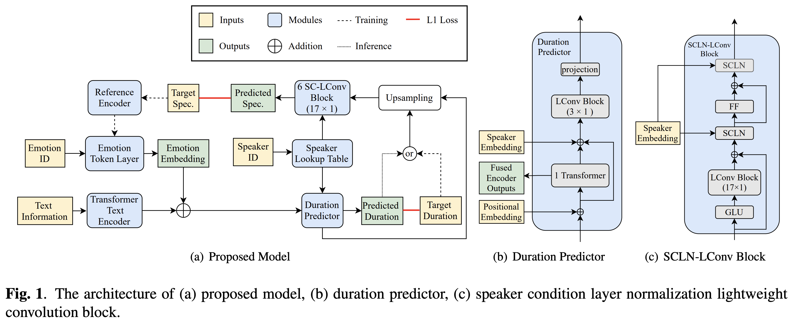
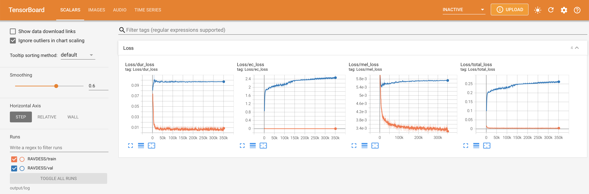
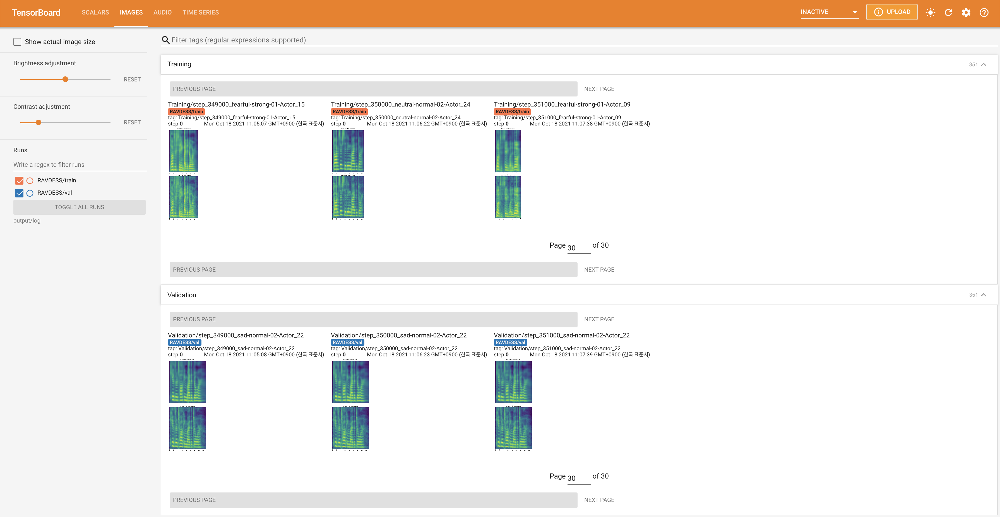
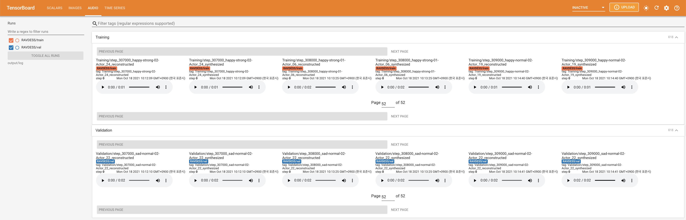
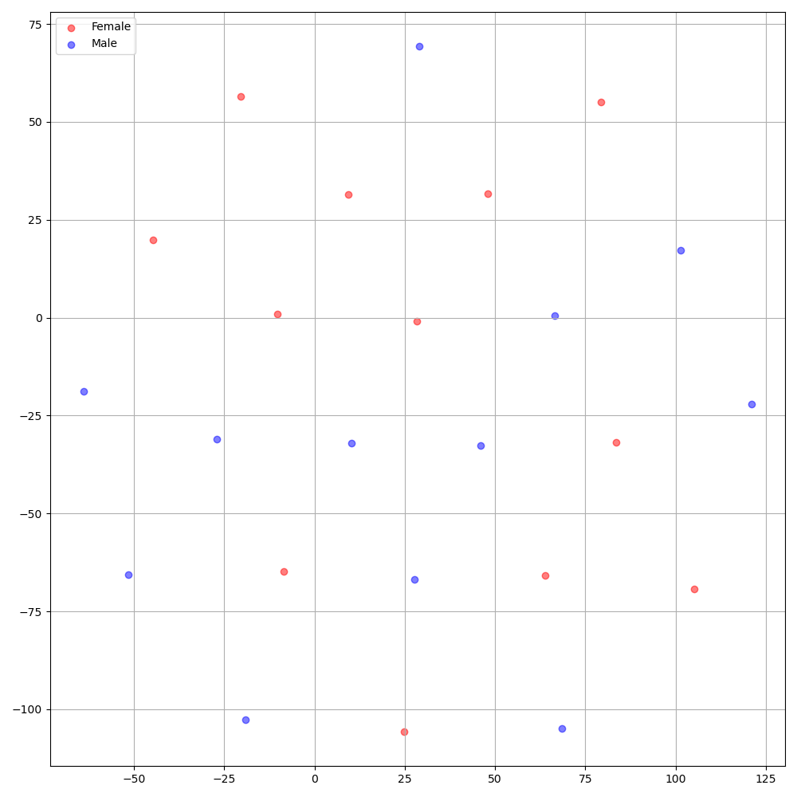

# Cross-Speaker-Emotion-Transfer - PyTorch Implementation

PyTorch Implementation of ByteDance's [Cross-speaker Emotion Transfer Based on Speaker Condition Layer Normalization and Semi-Supervised Training in Text-To-Speech](https://arxiv.org/abs/2110.04153). 

<p align="center">
    
</p>

## Audio Samples
Audio samples are available at [/demo](https://github.com/keonlee9420/Cross-Speaker-Emotion-Transfer/tree/main/demo).

# Quickstart

***DATASET*** refers to the names of datasets such as `RAVDESS` in the following documents.

## Dependencies
You can install the Python dependencies with
```
pip3 install -r requirements.txt
```
Also, install fairseq ([official document](https://fairseq.readthedocs.io/en/latest/index.html), [github](https://github.com/pytorch/fairseq)) to utilize `LConvBlock`. Please check [here](https://github.com/keonlee9420/Parallel-Tacotron2/issues/5) to resolve any issue on installing it.
Note that `Dockerfile` is provided for `Docker` users, but you have to install fairseq manually.

## Inference

You have to download the [pretrained models](https://drive.google.com/drive/folders/1QszdJC7dzBrQHntiLxYcG8ewczvoK4q1?usp=sharing) and put them in `output/ckpt/DATASET/`.

To extract soft emotion tokens from a reference audio, run
```
python3 synthesize.py --text "YOUR_DESIRED_TEXT" --speaker_id SPEAKER_ID --ref_audio REF_AUDIO_PATH --restore_step RESTORE_STEP --mode single --dataset DATASET
```
Or, to use hard emotion tokens from an emotion id, run
```
python3 synthesize.py --text "YOUR_DESIRED_TEXT" --speaker_id SPEAKER_ID --emotion_id EMOTION_ID --restore_step RESTORE_STEP --mode single --dataset DATASET
```

The dictionary of learned speakers can be found at `preprocessed_data/DATASET/speakers.json`, and the generated utterances will be put in `output/result/`.


## Batch Inference
Batch inference is also supported, try

```
python3 synthesize.py --source preprocessed_data/DATASET/val.txt --restore_step RESTORE_STEP --mode batch --dataset DATASET
```
to synthesize all utterances in `preprocessed_data/DATASET/val.txt`. Please note that only the hard emotion tokens from a given emotion id are supported in this mode.

# Training

## Datasets

The supported datasets are

- [RAVDESS](https://www.kaggle.com/uwrfkaggler/ravdess-emotional-speech-audio): This portion of the RAVDESS contains 1440 files: 60 trials per actor x 24 actors = 1440. The RAVDESS contains 24 professional actors (12 female, 12 male), vocalizing two lexically-matched statements in a neutral North American accent. Speech emotions includes calm, happy, sad, angry, fearful, surprise, and disgust expressions. Each expression is produced at two levels of emotional intensity (normal, strong), with an additional neutral expression.

**Your own language and dataset** can be adapted following [here](https://github.com/keonlee9420/Expressive-FastSpeech2).

## Preprocessing

- For a **multi-speaker TTS** with external speaker embedder, download [ResCNN Softmax+Triplet pretrained model](https://drive.google.com/file/d/1F9NvdrarWZNktdX9KlRYWWHDwRkip_aP) of [philipperemy's DeepSpeaker](https://github.com/philipperemy/deep-speaker) for the speaker embedding and locate it in `./deepspeaker/pretrained_models/`.
- Run 
  ```
  python3 prepare_align.py --dataset DATASET
  ```
  for some preparations.

  For the forced alignment, [Montreal Forced Aligner](https://montreal-forced-aligner.readthedocs.io/en/latest/) (MFA) is used to obtain the alignments between the utterances and the phoneme sequences.
  Pre-extracted alignments for the datasets are provided [here](https://drive.google.com/drive/folders/1fizpyOiQ1lG2UDaMlXnT3Ll4_j6Xwg7K?usp=sharing). 
  You have to unzip the files in `preprocessed_data/DATASET/TextGrid/`. Alternately, you can [run the aligner by yourself](https://montreal-forced-aligner.readthedocs.io/en/latest/aligning.html).

  After that, run the preprocessing script by
  ```
  python3 preprocess.py --dataset DATASET
  ```

## Training

Train your model with
```
python3 train.py --dataset DATASET
```

Useful options:
- To use [Automatic Mixed Precision](https://pytorch.org/tutorials/recipes/recipes/amp_recipe.html), append `--use_amp` argument to the above command.
- The trainer assumes single-node multi-GPU training. To use specific GPUs, specify `CUDA_VISIBLE_DEVICES=<GPU_IDs>` at the beginning of the above command.

# TensorBoard

Use
```
tensorboard --logdir output/log
```

to serve TensorBoard on your localhost.
The loss curves, synthesized mel-spectrograms, and audios are shown.





# Notes

- The current implementation is not trained in a semi-supervised way due to the small dataset size. But it can be easily activated by specifying target speakers and passing no emotion ID with no emotion classifier loss.
- In **Decoder**, 15 X 1 LConv Block is used instead of 17 X 1 due to memory issues.
- Two options for embedding for the **multi-speaker TTS** setting: training speaker embedder from scratch or using a pre-trained [philipperemy's DeepSpeaker](https://github.com/philipperemy/deep-speaker) model (as [STYLER](https://github.com/keonlee9420/STYLER) did). You can toggle it by setting the config (between `'none'` and `'DeepSpeaker'`).
- DeepSpeaker on RAVDESS dataset shows clear identification among speakers. The following figure shows the T-SNE plot of extracted speaker embedding.

<p align="center">
    
</p>

- For vocoder, **HiFi-GAN** and **MelGAN** are supported.

# Citation

Please cite this repository by the "[Cite this repository](https://github.blog/2021-08-19-enhanced-support-citations-github/)" of **About** section (top right of the main page).

# References
- [KinglittleQ's GST-Tacotron](https://github.com/KinglittleQ/GST-Tacotron)
- [keonlee9420's Parallel-Tacotron2](https://github.com/keonlee9420/Parallel-Tacotron2)
- [keonlee9420's StyleSpeech](https://github.com/keonlee9420/StyleSpeech)